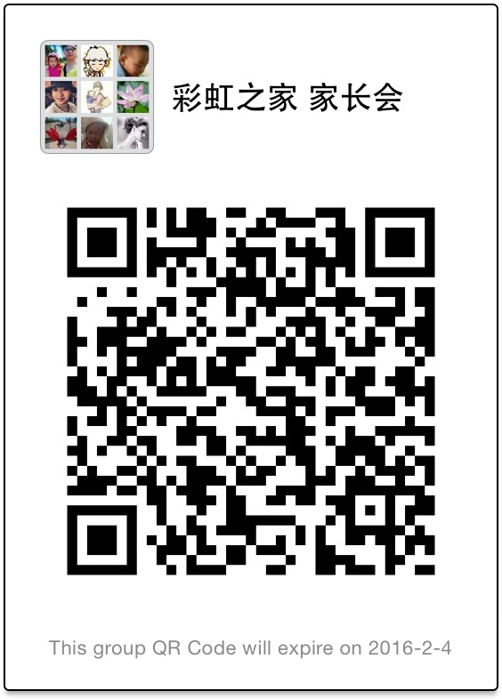

# “彩虹之家家长会”是什么？
上海特殊儿童家长互助中心－－“彩虹之家”，在上海儿童医学中心；香港鲍广恒儿童慈善基金会帮助下2006年6月成立，后于2012年3月重建，是由在上海市或孩子在上海市治疗的肿瘤患儿家长自发组成的非盈利民间互助团体，彩虹之家核心成员9人，现有QQ群500人，微信群370人。

“彩虹之家”的服务对象是上海市或在上海市接受治疗的儿童癌症患儿、康复者及其家长。“彩虹之家”组织目的是尽最大努力减少癌症对儿童及其家庭所造成的痛苦和伤害，我们是患者们共同的大家庭。 在这里我们互相支持，帮助患者及其家庭客服困难，重树信心，共度风雨，一起携手寻觅彩虹之后的幸福天空。

整合患儿家庭自身、医务工作者和其他关心患儿及其家庭的社会力量，通力协作，提供患儿家庭的支持平台。

宗旨：共同为促进血液肿瘤患儿的顺利治疗和他们家庭的心理重建，以及为血液肿瘤患儿的重返社会而努力。

# 如何加入“彩虹之家家长会”微信群？

