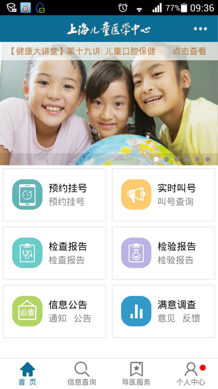

# 血液科门诊如何挂号？
1. 血液科门诊挂号地点在医院血液肿瘤中心大楼一楼（不是医院门诊大楼）。
2. 每天早上7点整开始挂号，上午门诊挂号结束时间是11点整，下午门诊挂号结束时间是16点整，逾时将不能挂号。
3. 每个门诊医生每半天只有20个号，其中包括已预约的号，因此当天现场能挂上号很有限，若当天去挂号，请提早排队。
4. 热门专家（如汤静燕主任），20个号中一般有17个号放网上预约，只留3个号给现场挂号，现场挂号通常要排通宵，没在前3位就排不到了，所以建议尽量网上预约。
5. 一般看医生前去验个血常规，等结果出来后再去找医生。
6. 宝宝准备好后将挂号单和病历本交给血液大楼1楼左边诊室前的护士台，护士叫号是按照挂号的顺序，所以早点去挂号就有早点看的权利。
7. 挂号请带上孩子就诊卡和现金，挂号费必须用现金支付。

# 血液科门诊安排
| 日期   | 时间 | 特需                               | 主任                           | 副主任             | 普通             |
|:-------|:-----|:-----------------------------------|:-------------------------------|:-------------------|:-----------------|
| 星期一 | 上午 | 薛惠良（308）                      | 汤静燕 陈静（大） 沈树红 |                    |                  |
| 星期一 | 下午 | 顾龙君（308） 陈静（小）（208） |                                |                    | 宋君红 韩亚丽 |
| 星期二 | 上午 |                                    | 薛惠良 高怡瑾               | 潘慈               |                  |
| 星期二 | 下午 | 高怡瑾（208）                      |                                |                    | 罗成娟 胡文婷 |
| 星期三 | 上午 | 汤静燕（308）                      |                                | 陈静（小）         |                  |
| 星期三 | 下午 | 汤静燕（308） 沈树红（208）     |                                |                    | 汤燕静 韩亚丽 |
| 星期四 | 上午 | 陈静（大）（308）                  |                                | 潘慈 陈静（小） | 李本尚           |
| 星期四 | 下午 |                                    |                                |                    | 周敏             |
| 星期五 | 上午 | 薛惠良（308）                      | 沈树红 高怡瑾               |                    |                  |
| 星期五 | 下午 | 潘慈（208）                        |                                | 罗长缨             | 米蔷             |

# 如何预约血液科门诊？
儿医中心支持多种血液科门诊预约方式：
1. 儿医中心手机APP 
   可到一楼护士台前扫描二维码下载软件，也可上手机应用市场搜索并下载“上海儿童医学中心”软件，手机注册后就可免费预约门诊，目前可以预约两周后的门诊，预约时间7:30 - 17:30。另外使用该软件，还可查询血常规、肝肾功能、尿常规、骨穿等检验报告，推荐安装。
   
2. 支付宝 
   - 进入支付宝-服务窗-关注挂号网-在挂号网注册成功后就能在挂号网上提前一周预约医生（每天更新时间7：30）。
   - 进入支付宝-服务窗-关注儿童医学中心。可以查看检验报告，比医院的APP稳定并且更新快。
3. 微医|挂号网 
   可以下载手机APP“微医”，或登录[挂号网](http://www.guahao.com)，用手机号注册帐号,然后进入填写孩子的信息,就可以进行预约了。微医一般是提前一星期进行预约,如果还有医生的号的话(或有人退号)可以提前一至三四天不等。微医还可添加三个亲属号,在你的帐号中为别人预约(但需有身份证号)。
4. 114名医导航 
   每月付费30元,可以提前二周预约, 打电话至021114，请对方客服人员转“名医导航”。
5. 门诊医生现场预约 
   看完医生门诊后，若能确定下次看门诊的时间,可在就诊时请求医生在电脑中预约下一次门诊(个人感觉这个需看医生当时的心情)。
6. 住院时预约门诊 
   若住院治疗将结束，可在通知出院的前一天下午2点至3点，到本楼层护士台文员处预约门诊。

# 什么是门诊加号？如何才能加号？
- 门诊加号是在医生特定的20个号挂完后,就是门诊加号。
- 需加号的家长可以在一边排队后，找叫号阿姨拿号。
- 但有的医生需经他同意，就等到8点上班同意后与阿姨拿号，挂号费58元。

# 什么是特需门诊？与普通门诊有什么区别？
- 特需门诊是特别需要的门诊,挂号费按医生级别不同而不同,副主任108元、208元，主任308元。
- 与普通门诊的区别: 首先是价格上比较贵, 相对于普通门诊好挂些，挂不上号时可以选此类门诊。(个人觉得医生态度耐心上没有太大的区别)。

# 什么是方便门诊？挂方便门诊能做什么？
- 方便门诊开放时间：
  - 周一：8:00 - 9:00    12:30 - 13:00
  - 周二至周五：12:30 - 13:00    16:00 - 16:30
  - 周六：15:00 - 16:00
  - 节假日：12:00 - 14:00
- 挂方便门诊可开血常规、肝肾功能、专科医生开好的输液连续输的方便门诊开、血小板单子、血红单子、正常的化验单子。通常明天要输的补液提前一天到方便门诊开好。

# 如何退号？
- 若是通过医院APP网上预约的，可以提前1天直接在网上取消预约；若是通过114名医导航预约的，必须提前2天才能取消预约；其它预约渠道的取消预约时限请见其规定。
- 若已超过取消预约时限，可以当天去挂号收费窗口，跟收费员说要取消预约，收费人员一般会帮你先开一张挂号发票，然后马上作废该挂号发票，这样就意味着已挂过号但没看医生就退号了，家长并不用付挂号费。
- 这样做的好处是不算爽约。因为预约了却不去挂号会算爽约，若爽约三次，系统会取约今后一段时间的预约资格，以后就不能预约而只能排队了，所以应避免爽约。
- 如果现场已经挂号了，若要退号，可以拿挂号发票先找门诊叫号的工作人员处理，再到收费窗口退费。

# 如何就诊？
1. 带孩子、病历本、就诊卡到血液科一楼。
2. 到预检处，让护士预检并盖章。
3. 把病历本、挂号发票交给护士台阿姨排队。快轮到时，阿姨会喊小孩名字。

# 门诊上疗怎么做？
1. 带上就诊卡、病历本、药品……早上8点在一楼门诊观察区护士台处排队。
2. 把就就诊卡、病历本、药品等交给护士登记。
3. 护士登记开单，家长交费等。
4. 若有需要，护士会安排床位。
5. 门诊打“门冬”注意事项：门冬需做皮试，皮试阴性才能注射。注射通常都是打屁股，打完观察半小时没有发皮疹、身上痒、屁股肿、呼吸困难等过敏反应再回家。门冬使用期间要低脂饮食，第一次都在病房里用，按护士知道的低脂饮食原则选择食物。

# 门诊缴费后发的条形码标签是干什么用的？
-	本医院很多化验都是先扫描条形码再做化验的，检查类型有：血常规、尿常规、大便检查、肝肾功能、骨穿、输血红时的备血等，如果遗失某张条形码那么就做不了该项检查了，所以要保管好。
- 检查后，可凭医生退回的一半条形码去自助报告打印机上扫条形码，打印化验报告。

# 门诊PICC换膜怎么做？
1. 首先要到自费药房那里买好PICC膜(需整套购买125元),需提前一周约下周的换膜时间,如没有预约，那么当天请早上8点左右到PICC室找护士加号，领取挂号纸（一张小纸签，上写PICC等字）。
2. 凭挂号纸和就诊卡去挂号。
3. 自带3瓶盐水、大小膜，将挂号单交到1016 PICC换膜室。
4. 一般宝宝需要独自进换膜室换膜，从进去到出来至少要半小时，要教宝宝拿好自己的东西，不要害怕独处。
5. PICC可以抽血做肝肾功能，不能做血常规。如果有抽血，与换膜一起进行是个不错的选择。

#	化疗泵护理？
- 化疗泵插针前要洗澡清洁皮肤，用绿色的爱护佳皮肤清洁液（装泵时护士会指导买的）清洁胸口皮肤。
- 化疗泵插针期间不能让针眼处进水，如发现观察伤口有渗血、敷贴里面有明显的出汗、敷贴周围都卷边不能保护插针、皮肤有明显的皮疹出现时，需要及时到中央静脉门诊换药处理。
- 化疗泵插针外露的管子要固定好，不要让孩子拿着玩，每个接口上的肝素帽不能取掉，万一发现脱落及时到医院门诊处理，晚上到住过院的病区处理。
- 化疗泵插针最多使用7天，超过时间必须先拔掉，到第二天观察伤口情况再决定是否可以插针。
- 拔针后皮肤上有个针眼，48小时会长好，如发现针眼局部红、肿、痛或有液体流出及时到门诊处理。

# 门诊骨穿、腰穿怎么预约？
## 门诊腰穿预约流程
1. 医生开具医嘱，确定腰穿时间
2. 家长至预约室预约
3. 护士根据时间预约，留取家长信息及电话
4. 给家长回执

注意事项：
- 腰穿时间：周一至周五，每天十位；节假日另行通知
- 如果当天超过10人，由预检护士与医生沟通再定时间
- 已预约的腰穿家长凭回执于腰穿当日9：00去血液观察室登记床位
- 登记床位时间9：00 - 10：00；过时不候，将作为放弃处理，需要做另行预约

## 门诊腰穿预约方法
- 预约方法：腰穿日前一周内（即<= 7天）可现场或电话预约
- 若因故预约日不能来，请提前（不得当日）取消（电话或现场告知），否则作为违约处理
- 预约或取消的联系时间：
  - 周一至周六下午13：00 - 15：00
  - 联系电话：021-38626161 * 82153
- 违约者下次不再接受电话预约
- 若当天床位有空余，可即开即做

## 骨穿不需预约
当天做骨穿的儿童务必上午11：30（初发白血病者在11：00）前到达护士站，超过该时间者请于明日规定时间内再来。

# 什么是骨穿？有哪些注意事项？
骨穿就是骨髓穿刺，用穿刺针进入骨髓腔抽取少量骨髓液，通过检测用于造血系统疾病的诊断、评估。

骨穿注意事项：
- 骨穿前让小孩子解小便。
- 骨穿中要摆好俯卧位趴着睡。
- 穿刺后按压伤口15-30分钟，至无渗血为止。
- 骨穿部位48小时内保持作品清洁干燥。
- 伤口出现渗血、渗液、红肿、疼痛等情况及时就诊。

# 门诊骨穿报告在哪里取？
一张报告在机器上就可扫出,另一张形态学需到二楼细胞室取。

# 什么是腰穿？有哪些注意事项？
腰穿是用穿刺针插入腰椎间隙，抽取少量脑脊液的操作，用于中枢神经系统白血病的诊断、预防和治疗，在整个治疗过程中需按计划定期进行。

腰穿注意事项：
- 腰穿前让小孩子解小便。
- 腰穿时保持“虾米状体位”：低头弯腰、双膝向腹部弯曲、双手抱膝，这是穿刺最佳体位。
- 穿刺成功留取少量脑脊液、注射药物、拔除腰穿针。
- 腰穿后去枕平卧4-6小时，如有头痛、呕吐等不适及时告知医护人员。
- 腰穿伤口24小时内保持清楚干燥，如有渗液及时告知医护人员。

# 门诊怎么打升白针？
1. 带上升白针、注射单、肌肉注射发票，当然还要带上孩子去门诊一楼观察区。
2. 把升白针、注射注、肌肉注射发票交给护士，护士即可安排打针。
3. 每天打升白针时间截止到下午3点半，3点半后护士一般就不给打升白针，所以要打的话趁早。
