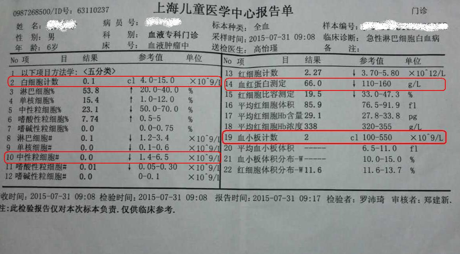

# 血常规

## 白细胞
白细胞（WBC） 在身体内起预防感染作用。
- WBC正常范围：4.0-15.0*109/L
- 白细胞低且无抵抗力时应注意以下几点：
  - 发热、口腔肛周溃疡、咽喉肿痛、咳嗽以及气急。
  - 关节疼痛、耳痛
  - 排尿困难、尿急尿痛及腹泻。
  - 皮肤发红、皮疹等

出现上述现象，立即告诉医生或立即到医院就诊，每天测量体温至少1次，耳温大于38.5度时及时就诊，未在医生指导下不要自行服用任何药物。

## 中性粒细胞
中性粒细胞提示是否处于感染的危险期。小于1.5则说明孩子容易感染，小于0.5时孩子处于危险感染期。以下列明如何预防感染：
- 限制探访人数，禁止接触水痘、风疹等传染病人。
- 洗手、戴口罩
- 勿接触小动物或植物
- 口腔护理以及肛门护理（坐浴）
- 饮食清洁：忌生食、隔夜食物。
- 严格按照医嘱应用抗生素

## 红细胞
红细胞是氧气的传递者。
- 血红蛋白：是细胞内携带氧气的蛋白，它的高低反映出血液能携带氧气。其正常范围：120-160g/L.红血蛋白小于60g/dl时，需输注红细胞。如遇血红蛋白降低时会出现以下症状：
  - 面色、指甲以及口唇苍白。
  - 手脚无力、爱睡觉
  - 头晕、头痛
  - 脉博加快
  - 呼吸急促
- 血小板：正常范围：100-350*109/L，如果小于20*109/L或有明显出血症状时，需要输血小板。严重的如：鼻出血、小便出血、大便黑等，每个孩子出血地方不同。输血要提前预约，血小板少而且保持期短。如遇血小板低下时会出现以下症状：
  - 皮肤出现淤青、淤点。
  - 鼻腔出血（预防）
  - 口腔出现血色或牙龈渗血。
  - 尿液中带血丝。
  - 有黑便或便血
  - 任何部位出血加压止血5-10分钟

## 其它补充
- 下疗后血象下跌期（下疗后7-10天）建议每天验血常规，尤其是第7-10天，因为要及时决定是否打升白、输血红或血小板。笔者就是一天血小板70，第二天没验，第三天直接跌倒20，加急都来不及了。
- 血象上涨期（下疗后7-10天后）一周两三次即可
- 如果发烧，就用带C反应蛋白的血常规条形码，注意C反应蛋白，如果高就考虑感染了。

# 尿常规
| 名称            | 正常                 | 异常                                                                                                                                            |
|:----------------|:---------------------|:------------------------------------------------------------------------------------------------------------------------------------------------|
| 酸碱度（pH）    | 4.6~8.0（平均值6.0） | <ul><li>增高常见于频繁呕吐、呼吸性碱中毒等</li><li>降低常见于酸中毒、慢性肾小球肾炎、糖尿病等</li></ul>                                         |
| 尿比重（SG）    | 1.015~1.025          | <ul><li>增高多见于高热、心功能不全、糖尿病等</li><li>降低多见于慢性肾小球肾炎和[肾盂肾炎](http://baike.haosou.com/doc/5338796.html)等</li></ul> |
| 尿胆原（URO）   | <16                  | 超过此数值，说明有黄疸                                                                                                                          |
| 隐血（BLO）     | 阴性（-）            | 阳性（+）同时有蛋白者，要考虑肾脏病和出血                                                                                                       |
| 白细胞（WBC）   | 阴性（-）            | 超过五个，说明[尿路感染](http://baike.haosou.com/doc/5356869.html)                                                                              |
| 尿蛋白（PRO）   | 阴性或仅有微量       | 阳性提示可能有急性肾小球肾炎、糖尿病肾性病变                                                                                                    |
| 尿糖（GLU）     | 阴性（-）            | 阳性提示可能有糖尿病、甲亢、肢端肥大症等                                                                                                        |
| 胆红素（BIL）   | 阴性（-）            | 阳性提示可能肝细胞性或阻塞性黄疸                                                                                                                |
| 酮体（KET）     | 阴性（-）            | 阳性提示可能酸中毒、糖尿病、呕吐、腹泻                                                                                                          |
| 尿红细胞（RBC） | 阴性（-）            | 阳性提示可能泌尿道肿瘤、肾炎尿路感染等                                                                                                          |
| 尿液颜色（GOL） | 浅黄色至深黄色       | 黄绿色、尿浑浊、血红色等就说明有问题                                                                                                            |

# 肝肾功能
## 肝肾功能在哪检查?
- 肝肾功能一般在医院主楼抽血中心做，抽无picc一侧手臂的静脉血。
- 如果心疼宝宝扎针，也可以在血液大楼一楼PICC换膜室从PICC管抽（抽血中心不会使用PICC，可能怕污染），但抽血前要先抽出10ml血弃掉，避免盐水对PICC血液的影响，而且PICC抽血和换膜一起排队，时间比较长。

## 肝肾功能要空腹吗？
TBD

## 肝肾功能和血常规可以一同做吗？
可以。如果肝肾功能是在抽血中心抽静脉血，那么可以将血常规条形码一起给抽血医生，告诉医生还要做血常规。医生会多抽几滴血，然后由家长自己交至血常规窗口化验，这样可避免宝宝单独做血常规时再扎一针。

## 读懂肝肾功能检查报告
| 英文    | 中文                                                     | 正常范围                                   |
|:--------|:---------------------------------------------------------|:-------------------------------------------|
| ALT     | 谷丙[转氨酶](http://baike.haosou.com/doc/5339546.html)   | 5-40 U/L(单位/升)                          |
| AST     | [谷草转氨酶](http://baike.haosou.com/doc/4818797.html)   | 8-40U/L(单位/升)                           |
| ALP     | 碱性磷酸酶                                               | 40-110 U                                   |
| γ-GT    | γ-转肽酶                                                 | < 50 U                                     |
| STB     | [总胆红素](http://baike.haosou.com/doc/5388592.html)     | 1.71-17.1μmol/L                            |
| CB      | [直接胆红素](http://baike.haosou.com/doc/348744.html)    | 1.71-7μmol/L(1-4mg/L)                      |
| UCB     | 间接胆红素                                               | 1.7-13.7μmol/L                             |
| GGT     | 谷氨酰转移酶                                             | 小于40单位                                 |
| Ch      | [总胆固醇](http://baike.haosou.com/doc/5134490.html)     | 儿童胆固醇3.12～5.20 mmol/L(120～200mg/dl) |
| AFP     | [甲胎蛋白](http://baike.haosou.com/doc/724781.html)      | 低于30μmg/L                                |
| PTA     | 凝血酶原活动度                                           | 75%～100%                                  |
| PA      | [凝血酶原时间](http://baike.haosou.com/doc/6446555.html) | 12-14秒                                    |
| CG      | 甘胆酸                                                   | 0.4~2.98mg/L                               |
| HA      | 透明质酸                                                 | 2-110ug/dl                                 |
| TBA     | 胆汁酸                                                   | <10μmol/L                                  |
| BUN     | 血尿素氮                                                 | 2.9-7.5mmol/L(8-21mg/dl)                   |
| NPN     | 血浆非蛋白氮                                             | 14.3-25mmol/L(20-35mg/dl)                  |
| Scr？   | 血清肌酐                                                 | 44-133μmol/L(0.8-1.5mg/dl)                 |
| CRE     | 肌酐                                                     | 0～159μmol/L                               |
| BUN/CRE |                                                          | 15～24：1                                  |
